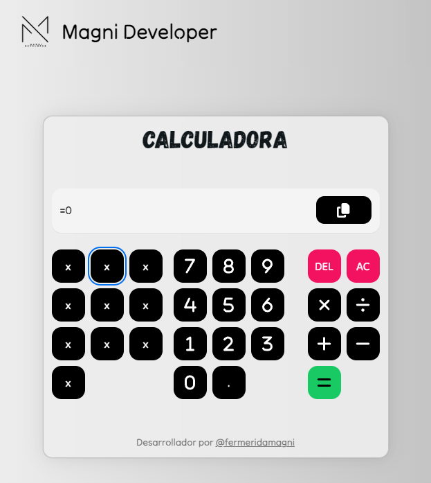

# CALCULATOR **by [@fermeridamagni](https://github.com/fermeridamagni "@fermeridamagni")**

#### URL'S

* PRODUCTION: [https://calculator.magnideveloper.com](https://calculator.magnideveloper.com/ "CALCULATOR by @fermeridamagni")
* DEVELOPMENT:

---

#### PREVIEW

---

#### PACKAGES IN USE

* next,
* react,
* react-dom,
* next-themes,
* clipboard-copy,
* eslint,
* eslint-config-next,
* autoprefixer,
* postcss,
* sonner,
* clsx,
* @nextui-org/react,
* clipboard-copy
* framer-motion
* mathjs
* sonner
* postcss,
* next-themes
* tailwindcss,
* tailwindcss-animated,
* tailwind-merge,
* @nextui-org/react,
* @fortawesome/fontawesome-svg-core,
* @fortawesome/free-brands-svg-icons,
* @fortawesome/free-regular-svg-icons,
* @fortawesome/free-solid-svg-icons,
* @fortawesome/react-fontawesome

---

@ **Magni Developer**

* **Page Web** : [https://magnideveloper.com](https://magnideveloper.com/ "Magni Developer")
* **Email** : [contacto@magnideveloper.com](mailto:contacto@magnideveloper.com "Contacto | Magni Developer")
